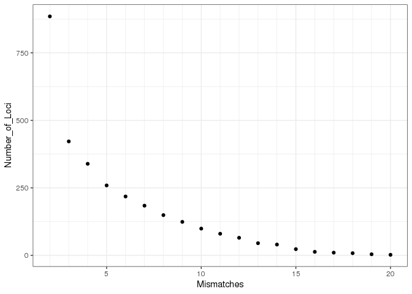

Final Project for BIO 594
================

## GitHub Documents

This is an R Markdown format used for publishing markdown documents to
GitHub. When you click the **Knit** button all R code chunks are run and
a markdown file (.md) suitable for publishing to GitHub is generated.

# Link to original github: <https://github.com/pdimens/2022-Tatlanticus_popgen>

# Data setup

- Population: 12 populations from 5 different localities (10 near sewage
  effluent sources, 2 controls)

- The sequenced data files are located on KITT and can be accessed via

  PATH: `/home/BIO594/Final_Project`

- Size: 376 individuals (28-33 per population), 150bp sequences

- Sequences were previously demultiplexed with barcodes and individuals
  from a different species were removed (completed by Dr. Jon Puritz)

# Bioinformatics

## Initial Raw Data Assessment and Characterization (Jon)

- Count the RAW reads
- Examine quality of data (fastqc)

## Reference assembly (Cass)

- De Novo Reference Assembly
  - Include optimization
  - Assemble only a subset of individuals

## RADSeq Bioinformatics (Caitlin)

- Trimming adapters and low quality reads (fastp via dDocent)
- Read Mapping (BWA & SAMtools via dDocent)
  - Try using different mappaing parameters on a subset and pick the
    best ones
- SNP calling and filtering (FreeBayes via dDocent)

## SNP Filtering (VCFtools, vcflib, rad_haplotyper) (Willow)

``` bash
conda create -n Final #create a conda enviro
conda activate Final #activate the conda enviro 
```

### We will apply 3 basic filtering steps

Remove genotypes with less than 5 reads

``` bash
vcftools --vcf TotalRawSNPs.vcf --recode-INFO-all --minDP 5 --out TRSdp5 --recode 
```

``` bash
After filtering, kept 379 out of 379 Individuals
Outputting VCF file...
After filtering, kept 1307614 out of a possible 1307614 Sites
Run Time = 1394.00 seconds
```

Keep variants genotyped in 50% of indv, a min quality score of 30, and
minor allele count of 3

``` bash
vcftools --vcf TRSdp5.recode.vcf --recode-INFO-all --max-missing 0.5 --mac 3 --minQ 30 --out TRSdp5g5mac3 --recode
```

``` bash
After filtering, kept 379 out of 379 Individuals
Outputting VCF file...
After filtering, kept 168317 out of a possible 1307614 Sites
Run Time = 275.00 seconds
```

Using Amy’s program to filter by minor allele frequency (This isn’t in
the dDocent instructions and I already filtered by minor allele count so
not sure if I should have also run this?)

``` bash
curl -L -O https://raw.githubusercontent.com/jpuritz/dDocent/master/scripts/untested/multi.maf.sh
chmod +x multi.maf.sh
multi.maf.sh TRSdp5g5mac3.recode.vcf 0.001 TRSdp5g5mac3maf
```

``` bash
After filtering, kept 379 out of 379 Individuals
Outputting VCF file...
After filtering, kept 168317 out of a possible 168317 Sites
Run Time = 188.00 seconds
```

Now we will filter out individuals that did not sequence well
\<\<\<\<\<\<\< HEAD

``` bash
curl -L -O https://raw.githubusercontent.com/jpuritz/dDocent/master/scripts/filter_missing_ind.sh #bash script 
chmod +x filter_missing_ind.sh
./filter_missing_ind.sh TRSdp5g5mac3maf.recode.vcf TRSdp5g5mac3maf5MIa
```

``` bash

After filtering, kept 379 out of 379 Individuals
Outputting Individual Missingness
After filtering, kept 168317 out of a possible 168317 Sites
Run Time = 14.00 seconds

                                          Histogram of % missing data per individual
     Number of Occurrences
       45 ++---------+----**---+----------+---------+----------+----------+---------+----------+---------+---------++
          +          +    **   +          +         +          'totalmissing' using (bin($1,binwidth)):(1.0) ****** +
          |              ***                                                                                        |
       40 ++             ***                                                                                       ++
          |              ***                                                                                        |
       35 ++             ***                                                                                       ++
          |              ***                                                                                        |
          |              ***                                                                                        |
       30 ++             ***                                                                                       ++
          |              ***                                                                                        |
       25 ++            ****                                                                                       ++
          |             *****                                                                                       |
          |           ********                                                                                      |
       20 ++          ********                                                                                     ++
          |          *********                                                                                      |
       15 ++         *********                                                                                     ++
          |          *********                                                                                      |
          |          *********  **                                                                                  |
       10 ++        ****************                                                                               ++
          |   **    ******************                                                         **                   |
        5 ++  ****  **************** ***                                                     ****                  ++
          |   ********************** *** ******                                              ****               **  |
          + ******* **************** ****** * **********************************************************************+
        0 ++********************************************************************************************************+
          0         0.1       0.2        0.3       0.4        0.5        0.6       0.7        0.8       0.9         1
                                                       % of missing data

The 85% cutoff would be 0.285634
Would you like to set a different cutoff, yes or no
yes
Please enter new cutoff
0.5
All individuals with more than 50.0% missing data will be removed.
Excluding individuals in 'exclude' list
After filtering, kept 341 out of 379 Individuals
Outputting VCF file...
After filtering, kept 168317 out of a possible 168317 Sites
Run Time = 171.00 seconds
```

Removing indv that JP specified as they are a different species. (I
should have done this sooner but forgot)

``` bash
vcftools --vcf TRSdp5g5mac3maf5MIa.recode.vcf --remove indv_to_remove.txt --recode-INFO-all --out TRSdp5g5mac3maf5MIasub --recode
```

We will now filter out missing data at the population level

``` bash
ln -s ../assembly/popmap . #create a link to the popmap in the assembly file 
curl -L -O https://raw.githubusercontent.com/jpuritz/dDocent/master/scripts/pop_missing_filter.sh
chmod +x pop_missing_filter.sh
./pop_missing_filter.sh TRSdp5g5mac3maf5MIasub.recode.vcf popmap 0.1 1 TRSdp5g5mac3mafMIasubp9
```

``` bash
After filtering, kept 338 out of 338 Individuals
Outputting VCF file...
After filtering, kept 63322 out of a possible 168317 Sites
Run Time = 69.00 seconds
```

Filter out sites with less than 95% overall call rate and minor allele
freq of 0.001

``` bash
vcftools --vcf TRSdp5g5mac3mafMIasubp9.recode.vcf --recode-INFO-all --max-missing 0.95 --maf 0.001 --out TRSdp5g5mac3mafMIasubp9g9 --recode
```

``` bash
After filtering, kept 338 out of 338 Individuals
Outputting VCF file...
After filtering, kept 50271 out of a possible 63322 Sites
Run Time = 52.00 seconds
```

Running dDocent filter script - site depth, quality vs depth, strand
rep, allelic balance of heterozygotes

``` bash
curl -L -O https://raw.githubusercontent.com/jpuritz/dDocent/master/scripts/dDocent_filters
chmod +x dDocent_filters
./dDocent_filters TRSdp5g5mac3mafMIasubp9g9.recode.vcf TRSdp5g5mac3mafMIasubp9g9d
```

``` bash
This script will automatically filter a FreeBayes generated VCF file using criteria related to site depth,
quality versus depth, strand representation, allelic balance at heterzygous individuals, and paired read representation.
The script assumes that loci and individuals with low call rates (or depth) have already been removed. 

Contact Jon Puritz (jpuritz@gmail.com) for questions and see script comments for more details on particular filters 

Number of sites filtered based on allele balance at heterozygous loci, locus quality, and mapping quality / Depth
 17176 of 50271 

Are reads expected to overlap?  In other words, is fragment size less than 2X the read length?  Enter yes or no.
yes
Is this from a mixture of SE and PE libraries? Enter yes or no.
no
Number of additional sites filtered based on properly paired status
 960 of 33095 

Number of sites filtered based on high depth and lower than 2*DEPTH quality score
 2536 of 32135 

                                               Histogram of mean depth per site
    Number of Occurrences
      350 +++----+----+----+-----+----+----+----+----+----+-----+-**-+----+----+----+-----+----+----+----+----+----++
          | +    +    +    +     +    +    +    +    +    +'meandepthpersite' using (bin($1,binwidth)):(1.0) ******+|
          |                                                       **                                                |
      300 ++                                      *          *  ****                                               ++
          |                                       *          ** ****    **                                          |
          |                                       *    ***** ** **** *  **                                          |
          |                                       * **************** *  **                                          |
      250 ++                                      ****************** ** ***                                        ++
          |                                     *********************** ***                                         |
          |                                     *********************** *** *                                       |
      200 ++                          *      ** *****************************                                      ++
          |                           *     *********************************                                       |
          |                           *** * *********************************                                       |
      150 ++                       *  *** * *********************************                                      ++
          |                        *  *** * ***********************************                                     |
          |                  ** ** *  *****************************************  **                                 |
      100 ++                ****** ************************************************                                ++
          |                *********************************************************                                |
          |             * **********************************************************                                |
          |             * ************************************************************  *                           |
       50 ++            *************************************************************** **  **                     ++
          |       **** ***************************************************************************   *  *           |
          | +********************************************************************************************************
        0 +++********************************************************************************************************
            16   32   48   64    80   96  112  128  144  160   176  192  208  224  240   256  272  288  304  320  336
                                                          Mean Depth

If distrubtion looks normal, a 1.645 sigma cutoff (~90% of the data) would be 145253.312
The 95% cutoff would be 308
Would you like to use a different maximum mean depth cutoff than 308, yes or no
no
Number of sites filtered based on maximum mean depth
 1685 of 32135 

Number of sites filtered based on within locus depth mismatch
 19 of 30447 

Total number of sites filtered
 19843 of 50271 

Remaining sites
 30428 

Filtered VCF file is called TRSdp5g5mac3mafMIasubp9g9d.FIL.recode.vcf

Filter stats stored in TRSdp5g5mac3mafMIasubp9g9d.filterstats
```

Next we will break up complex mutational events into separate SNP and
INDEL (insertion-deletion) calls to remove INDELS

``` bash
vcfallelicprimitives TRSdp5g5mac3mafMIasubp9g9d.FIL.recode.vcf --keep-info --keep-geno > TRSdp5g5mac3mafMIasubp9g9d.prim.vcf
vcftools --vcf TRSdp5g5mac3mafMIasubp9g9d.prim.vcf --remove-indels --recode --recode-INFO-all --out SNP.TRSdp5g5mac3mafMIasubp9g9d
```

``` bash
After filtering, kept 338 out of 338 Individuals
Outputting VCF file...
 Duplicate alternate alleles found at dDocent_Contig_19543:41
 Duplicate alternate alleles found at dDocent_Contig_29303:64
After filtering, kept 26737 out of a possible 28609 Sites
Run Time = 27.00 seconds
```

This data set has technical replicates. JP provided a bash script and
tsv file with duplicate sample names. Run the program to produce a list
of mismatched loci (i.e. where one replicate has a and another has a g)

``` bash
bash dup_sample_filter SNP.TRSdp5g5mac3mafMIasubp9g9d.recode.vcf duplicates.samples
```

I got this error when trying to execute the script

``` bash
Warning: Expected at least 2 parts in FORMAT entry: ID=GL,Number=G,Type=Float,Description="Genotype Likelihood, log10-scaled likelihoods of the data given the called genotype for each possible genotype generated from the reference and alternate alleles given the sample ploidy">
Keeping individuals in 'keep' list
After filtering, kept 1 out of 338 Individuals
Outputting VCF file...
After filtering, kept 26737 out of a possible 26737 Sites
Run Time = 7.00 seconds
rm: cannot remove ‘FBN_327a.recode.vcf’: No such file or directory
rm: cannot remove ‘keep.FBN_327a’: No such file or directory
rm: cannot remove ‘FBN_327b.recode.vcf’: No such file or directory
rm: cannot remove ‘keep.FBN_327b’: No such file or directory
rm: cannot remove ‘FBN_327a.recode.vcf’: No such file or directory
rm: cannot remove ‘FBN_327a.recode.vcf’: No such file or directory
rm: cannot remove ‘keep.FBN_327a’: No such file or directory
rm: cannot remove ‘keep.FBN_327a’: No such file or directory
rm: cannot remove ‘FBN_327c.recode.vcf’: No such file or directory
rm: cannot remove ‘keep.FBN_327c’: No such file or directory
rm: cannot remove ‘FBN_327a.recode.vcf’: No such file or directory
rm: cannot remove ‘FBN_327a.recode.vcf’: No such file or directory
rm: cannot remove ‘keep.FBN_327a’: No such file or directory
rm: cannot remove ‘keep.FBN_327a’: No such file or directory
rm: cannot remove ‘FBN_327d.recode.vcf’: No such file or directory
rm: cannot remove ‘keep.FBN_327d’: No such file or directory
rm: cannot remove ‘FBN_327b.recode.vcf’: No such file or directory
rm: cannot remove ‘FBN_327b.recode.vcf’: No such file or directory
rm: cannot remove ‘keep.FBN_327b’: No such file or directory
rm: cannot remove ‘keep.FBN_327b’: No such file or directory
rm: cannot remove ‘FBN_327c.recode.vcf’: No such file or directory
rm: cannot remove ‘FBN_327c.recode.vcf’: No such file or directory
rm: cannot remove ‘keep.FBN_327c’: No such file or directory
rm: cannot remove ‘keep.FBN_327c’: No such file or directory
rm: cannot remove ‘FBN_327b.recode.vcf’: No such file or directory
rm: cannot remove ‘FBN_327b.recode.vcf’: No such file or directory
rm: cannot remove ‘keep.FBN_327b’: No such file or directory
rm: cannot remove ‘keep.FBN_327b’: No such file or directory
rm: cannot remove ‘FBN_327d.recode.vcf’: No such file or directory
rm: cannot remove ‘FBN_327d.recode.vcf’: No such file or directory
rm: cannot remove ‘keep.FBN_327d’: No such file or directory
rm: cannot remove ‘keep.FBN_327d’: No such file or directory
rm: cannot remove ‘FBN_327c.recode.vcf’: No such file or directory
rm: cannot remove ‘FBN_327c.recode.vcf’: No such file or directory
rm: cannot remove ‘keep.FBN_327c’: No such file or directory
rm: cannot remove ‘keep.FBN_327c’: No such file or directory
rm: cannot remove ‘FBN_327d.recode.vcf’: No such file or directory
rm: cannot remove ‘FBN_327d.recode.vcf’: No such file or directory
rm: cannot remove ‘keep.FBN_327d’: No such file or directory
rm: cannot remove ‘keep.FBN_327d’: No such file or directory
rm: cannot remove ‘OBN_9b.recode.vcf’: No such file or directory
rm: cannot remove ‘keep.OBN_9b’: No such file or directory
rm: cannot remove ‘OBN_9c.recode.vcf’: No such file or directory
rm: cannot remove ‘keep.OBN_9c’: No such file or directory
rm: cannot remove ‘OBN_9b.recode.vcf’: No such file or directory
rm: cannot remove ‘OBN_9b.recode.vcf’: No such file or directory
rm: cannot remove ‘keep.OBN_9b’: No such file or directory
rm: cannot remove ‘keep.OBN_9b’: No such file or directory
rm: cannot remove ‘OBN_9d.recode.vcf’: No such file or directory
rm: cannot remove ‘keep.OBN_9d’: No such file or directory
rm: cannot remove ‘OBN_9c.recode.vcf’: No such file or directory
rm: cannot remove ‘OBN_9c.recode.vcf’: No such file or directory
rm: cannot remove ‘keep.OBN_9c’: No such file or directory
rm: cannot remove ‘keep.OBN_9c’: No such file or directory
rm: cannot remove ‘OBN_9d.recode.vcf’: No such file or directory
rm: cannot remove ‘OBN_9d.recode.vcf’: No such file or directory
rm: cannot remove ‘keep.OBN_9d’: No such file or directory
rm: cannot remove ‘keep.OBN_9d’: No such file or directory
rm: cannot remove ‘OBS_245a.recode.vcf’: No such file or directory
rm: cannot remove ‘keep.OBS_245a’: No such file or directory
rm: cannot remove ‘OBS_245b.recode.vcf’: No such file or directory
rm: cannot remove ‘keep.OBS_245b’: No such file or directory
rm: cannot remove ‘OBS_245a.recode.vcf’: No such file or directory
rm: cannot remove ‘OBS_245a.recode.vcf’: No such file or directory
rm: cannot remove ‘keep.OBS_245a’: No such file or directory
rm: cannot remove ‘keep.OBS_245a’: No such file or directory
rm: cannot remove ‘OBS_245c.recode.vcf’: No such file or directory
rm: cannot remove ‘keep.OBS_245c’: No such file or directory
rm: cannot remove ‘OBS_245a.recode.vcf’: No such file or directory
rm: cannot remove ‘OBS_245a.recode.vcf’: No such file or directory
rm: cannot remove ‘keep.OBS_245a’: No such file or directory
rm: cannot remove ‘keep.OBS_245a’: No such file or directory
rm: cannot remove ‘OBS_245d.recode.vcf’: No such file or directory
rm: cannot remove ‘keep.OBS_245d’: No such file or directory
rm: cannot remove ‘OBS_245b.recode.vcf’: No such file or directory
rm: cannot remove ‘OBS_245b.recode.vcf’: No such file or directory
rm: cannot remove ‘keep.OBS_245b’: No such file or directory
rm: cannot remove ‘keep.OBS_245b’: No such file or directory
rm: cannot remove ‘OBS_245c.recode.vcf’: No such file or directory
rm: cannot remove ‘OBS_245c.recode.vcf’: No such file or directory
rm: cannot remove ‘keep.OBS_245c’: No such file or directory
rm: cannot remove ‘keep.OBS_245c’: No such file or directory
rm: cannot remove ‘OBS_245b.recode.vcf’: No such file or directory
rm: cannot remove ‘OBS_245b.recode.vcf’: No such file or directory
rm: cannot remove ‘keep.OBS_245b’: No such file or directory
rm: cannot remove ‘keep.OBS_245b’: No such file or directory
rm: cannot remove ‘OBS_245d.recode.vcf’: No such file or directory
rm: cannot remove ‘OBS_245d.recode.vcf’: No such file or directory
rm: cannot remove ‘keep.OBS_245d’: No such file or directory
rm: cannot remove ‘keep.OBS_245d’: No such file or directory
rm: cannot remove ‘OBS_245c.recode.vcf’: No such file or directory
rm: cannot remove ‘OBS_245c.recode.vcf’: No such file or directory
rm: cannot remove ‘keep.OBS_245c’: No such file or directory
rm: cannot remove ‘keep.OBS_245c’: No such file or directory
rm: cannot remove ‘OBS_245d.recode.vcf’: No such file or directory
rm: cannot remove ‘OBS_245d.recode.vcf’: No such file or directory
rm: cannot remove ‘keep.OBS_245d’: No such file or directory
rm: cannot remove ‘keep.OBS_245d’: No such file or directory
```

JP helped me troubleshoot - the duplicates.samples file was had spaces
seperating the columns instead of tabs

``` bash
echo -e "Mismatches\tNumber_of_Loci" > mismatch.txt
for i in {2..20}
do
paste <(echo $i) <(mawk -v x=$i '$1 > x' mismatched.loci | wc -l) >> mismatch.txt
done
```

\<\<\<\<\<\<\< HEAD

In RStudio

``` r
library(ggplot2)
mismatch <- read.table("/home/BIO594/Final_Project/SNP_Filtering/mismatch.txt", header = TRUE)
df=data.frame(mismatch)

p <- ggplot(df, aes(x=Mismatches, y=Number_of_Loci)) + geom_point() +theme_bw() + scale_x_continuous(minor_breaks = seq(1,20,by=1))
p
```

<!-- -->

Filter out loci with mismatch \> 6

``` bash
mawk '$1 > 6' mismatched.loci | cut -f2,3 > mismatchedloci
vcftools --vcf SNP.TRSdp5g5mac3mafMIasubp9g9d.recode.vcf --exclude-positions mismatchedloci --recode --recode-INFO-all --out SNP.TRSdp5g5mac3mafMIasubp9g9dMM
```

``` bash
After filtering, kept 338 out of 338 Individuals
Outputting VCF file...
After filtering, kept 26519 out of a possible 26737 Sites
Run Time = 27.00 seconds
```

Run rad_haplotyper.pl program. First cp the filtered vcf file into the
dDocent_working_dir

``` bash
cp SNP.TRSdp5g5mac3mafMIasubp9g9dMM.recode.vcf ../dDocent_working_dir
cd ../dDocent_working_dir
```

``` bash
curl -L -O https://raw.githubusercontent.com/chollenbeck/rad_haplotyper/e8bdc79f1d1d9ce3d769996315fc1ffd3a7d0e4e/rad_haplotyper.pl

chmod +x rad_haplotyper.pl
rad_haplotyper.pl -p popmap -v SNP.TRSdp5g5mac3mafMIasubp9g9dMM.recode.vcf -r reference.fasta -g SNPTRSdp5g5mac3mafMIasubp9g9dMM -mp 5 -x 40 -z 0.1 -e
```

``` bash
Filtered 57 loci below missing data cutoff
Filtered 144 possible paralogs
Filtered 0 loci with low coverage or genotyping errors
Filtered 0 loci with an excess of haplotypes
Writing Genepop file: SNPTRSdp5g5mac3mafMIasubp9g9dMM
```

All additional loci to be removed are stored in stats.out Create a list
of loci to filter out then use the script to remove them

``` bash
mawk '/FILT/' stats.out | cut -f1 > bad.hap.dp3.loci

curl -L -O https://raw.githubusercontent.com/jpuritz/dDocent/master/scripts/remove.bad.hap.loci.sh
chmod +x remove.bad.hap.loci.sh
./remove.bad.hap.loci.sh bad.hap.dp3.loci SNP.TRSdp5g5mac3mafMIasubp9g9dMM.recode.vcf
```

``` bash
vcftools --vcf SNP.TRSdp5g5mac3mafMIasubp9g9dMM.filtered.vcf --missing-indv
```

``` bash
After filtering, kept 338 out of 338 Individuals
Outputting Individual Missingness
After filtering, kept 25117 out of a possible 25117 Sites
Run Time = 2.00 seconds
```

Revising data for technical replicates

``` bash
mawk '/FBN_327/ || /OBN_9/ || /OBN_009/ || /OBS_245/ || /PCN_210/ || /PCN_223/ || /PCS_361/ || /PCS_365/ || /SPC_92/ || /WC2_301/ || /WC2_305/ || /SPS_74/ || /SPS_92/' out.imiss > dup.imiss

mawk '!/FBN_327b/ && !/OBN_9b/ && !/OBS_245b/ && !/PCN_210b/ && !/PCN_223b/ && !/PCS_361b/ && !/PCS_365a/ && !/SPS_74a/ && !/SPS_92c/ && !/WC2_301a/ && !/WC2_305b/' dup.imiss > duplicate.samples.to.remove

vcftools --vcf SNP.TRSdp5g5mac3mafMIasubp9g9dMM.filtered.vcf --recode --recode-INFO-all --out SNP.TRSdp5g5mac3mafMIasubp9g9dMM --remove duplicate.samples.to.remove
```

``` bash
After filtering, kept 318 out of 338 Individuals
Outputting VCF file...
After filtering, kept 25117 out of a possible 25117 Sites
Run Time = 24.00 seconds
```

Filter out loci not in HWE in more than 50% populations

``` bash
curl -L -O https://raw.githubusercontent.com/jpuritz/dDocent/master/scripts/filter_hwe_by_pop.pl
chmod +x filter_hwe_by_pop.pl
./filter_hwe_by_pop.pl -v SNP.TRSdp5g5mac3mafMIasubp9g9dMM.recode.vcf -c 0.5 -p popmap -o SNP.TRSdp5g5mac3mafMIasubp9g9dMMHWE
```

``` bash
Processing population: FBN (33 inds)
Processing population: FBS (30 inds)
Processing population: OBN (31 inds)
Processing population: OBS (32 inds)
Processing population: PCN (33 inds)
Processing population: PCS (33 inds)
Processing population: SPN (33 inds)
Processing population: SPS (33 inds)
Processing population: WC1 (28 inds)
Processing population: WC2 (33 inds)
Processing population: WC3 (29 inds)
Processing population: WC4 (31 inds)
Outputting results of HWE test for filtered loci to 'filtered.hwe'
Kept 25016 of a possible 25117 loci (filtered 101 loci)
```

Filter for minor allele freq and convert

``` bash
vcftools --vcf SNP.TRSdp5g5mac3mafMIasubp9g9dMMHWE.recode.vcf --recode --recode-INFO-all --out SNP.TRSdp5g5mac3mafMIasubp9g9dMMHWEmaf0252A --maf 0.025 --max-alleles 2
```

``` bash
After filtering, kept 318 out of 318 Individuals
Outputting VCF file...
After filtering, kept 7942 out of a possible 25016 Sites
Run Time = 9.00 seconds
```

Final vcf file
`{bash, eval=FALSE} SNP.TRSdp5g5mac3mafMIasubp9g9dMMHWEmaf0252A.recode.vcf`
hs 7942 loci

copy it into the popgen analyses folder

# Population-level Analyses

## Detecting Selection Via Outlier Detection Programs (Flow and Michelle)

      * RDA 
      * Bayenv2
      * PCAadapt
      * Outflank

## Detecting Population Structure (Brittany and Angela)

      * Pairwise *F~ST~*
      * Genetic diversity (observed and expected heterozygosity)
      * EEMS (https://www.nature.com/articles/ng.3464)
